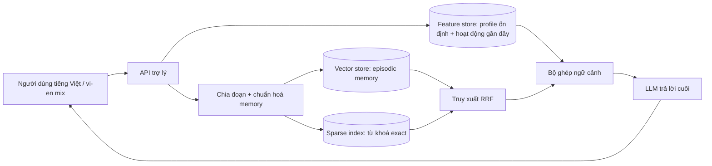

# Kiến Trúc Bonus — Hybrid Memory Agent

**Người thực hiện:** Hà Huy Nhất

## Sơ Đồ

POC này tách rõ 2 nhóm người. Episodic memory gồm hội thoại, ghi chú và tài liệu đã đọc; loại dữ liệu này
thay đổi thường xuyên và cần tìm kiếm ngữ nghĩa. Stable profile và recent
activity là online features: nhỏ, có kiểu dữ liệu rõ ràng, và phải sẵn sàng
trước khi tạo câu trả lời. Vì vậy, mỗi lần recall thực hiện hai lượt đọc:
hybrid search vector/BM25 có filter theo `user_id`, và lookup feature cho
`topic_affinity`, `reading_speed_wpm`, `preferred_language`,
`queries_last_hour`. Prompt cuối cho LLM nhận cả bằng chứng truy xuất lẫn thông
tin cá nhân hoá.

## Quyết Định 1 — Chiến Lược Chia Chunk

Em chọn chunk ngắn theo ranh giới gần-ngữ-nghĩa, cỡ một đoạn văn hoặc khoảng
400-700 token, thay vì lưu cả cuộc hội thoại thành một vector hoặc tách từng
message đơn lẻ. Chunk theo từng message rẻ và dễ ghi nhưng thường mất ngữ cảnh:
"bài đó" hoặc "ghi chú Kubernetes trước" sẽ trở nên mơ hồ. Chunk theo cả cuộc
hội thoại giữ được ngữ cảnh nhưng giảm chất lượng truy xuất, vì một vector phải
đại diện cho quá nhiều chủ đề; nó cũng lãng phí context window khi chỉ cần một
ý nhỏ. Chunk ngắn cho top-k precision tốt hơn trong khi chi phí lưu trữ vẫn hợp
lý cho trợ lý cá nhân. Với người dùng Việt Nam, hệ thống nên chuẩn hoá Unicode,
giữ nguyên thuật ngữ tiếng Anh bị code-switch như Kubernetes/IAM, và không nên
phụ thuộc mãi vào whitespace split. Khi lên production, pyvi hoặc underthesea
có thể cải thiện ranh giới chunk; trong demo tối giản, whitespace là đủ.

## Quyết Định 2 — Schema Feature

Feature store ưu tiên các feature dạng bảng trước: `preferred_language` TTL 30
ngày, `reading_speed_wpm` TTL 30 ngày, `topic_affinity` TTL 7-30 ngày, và
`queries_last_hour` TTL 1 giờ. Entity chính là `user_id`. Stable features đến
từ profile settings và lịch sử đọc dài hạn; fresh features đến từ query events
gần đây. Em đã cân nhắc mã hoá toàn bộ user profile thành một latent vector,
nhưng chọn feature bảng rõ ràng vì dễ kiểm tra, dễ debug, và dễ dùng trong luật
như "ưu tiên tóm tắt tiếng Việt dưới 700 chữ". Embedding features có ích về sau
để học sở thích ẩn, nhưng làm privacy review và training-serving skew khó kiểm
soát hơn.

Schema này bám trực tiếp vào bài Feast trong lab: khi training phải dùng
point-in-time join để tránh leakage, còn khi serving phải dùng online lookup
latency thấp. TTL khác nhau vì reading speed cũ không quá nguy hiểm, nhưng
recent activity cũ có thể khiến trợ lý nói sai rằng người dùng đang quan tâm
một chủ đề từ hôm qua.

## Quyết Định 3 — Chiến Lược Freshness

Freshness được chia theo use case. Thứ nhất, ghi chú người dùng bấm lưu thủ
công phải xuất hiện trong recall trong vài giây, nên được push trực tiếp vào
vector store tại thời điểm ghi. Thứ hai, câu hỏi "tôi nên đọc gì tiếp?" có thể
chịu trễ khoảng năm phút vì nó phụ thuộc trend chủ đề, không phải một event đơn
lẻ. Thứ ba, cập nhật sở thích dài hạn như reading speed hoặc stable affinity
có thể chạy batch hằng ngày vì không nên dao động chỉ sau một bài viết. Tradeoff
là chi phí và độ phức tạp vận hành: streaming sub-second làm memory có cảm giác
"nhớ ngay", nhưng cần idempotent writes, backfill và monitoring; batch refresh
rẻ hơn nhưng có thể khiến trợ lý trông như vừa quên tài liệu quan trọng.

## Phương Án Bị Loại

Em đã xem xét lưu episodic memory bên trong feature store như một embedding
feature view. Em loại phương án này vì memory và profile có write/query pattern
rất khác nhau. Episodic memory cần top-k nearest-neighbor search, xoá/sửa,
deduplication và re-embedding khi đổi model. Feature store cần point lookup có
kiểu dữ liệu rõ ràng và PIT join. Gộp hai thứ này vào một hệ sẽ làm cả hai mờ
đi và khó xác định ownership cho freshness, TTL, cũng như migration.

## Lưu Ý Cho Ngữ Cảnh Việt Nam

Người dùng Việt Nam thường code-switch: "cloud security", "Kubernetes
autoscale" và các câu diễn đạt lại bằng tiếng Việt có thể cùng chỉ một khái
niệm. Vì vậy retrieval stack cần hybrid search: BM25 bảo vệ acronym, product
name và thuật ngữ tiếng Anh exact-match, còn vector search bắt được paraphrase
tiếng Việt. Tokenization cũng quan trọng; whitespace split chấp nhận được trong
lab, nhưng production nên benchmark pyvi, underthesea hoặc model multilingual
như `bge-m3`. Riêng dữ liệu cá nhân, ghi chú công việc và profile features phải
được isolate theo user, mã hoá khi lưu, và không bao giờ được serve chéo tenant.

## Giới Hạn Của POC

Demo chưa gọi LLM thật, chưa mã hoá memories, và chưa có workflow sửa/xoá
memory. Nó cũng dùng Qdrant in-memory, nên memory mất khi process kết thúc.
Bản production cần test isolation theo tenant, policy retention theo user,
kế hoạch migration khi đổi embedding model, và observability để phát hiện
false recall.
